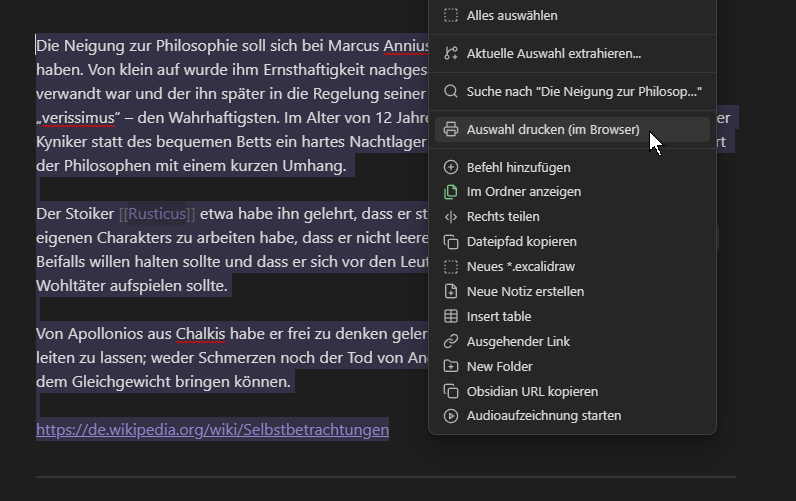
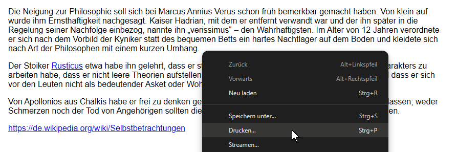
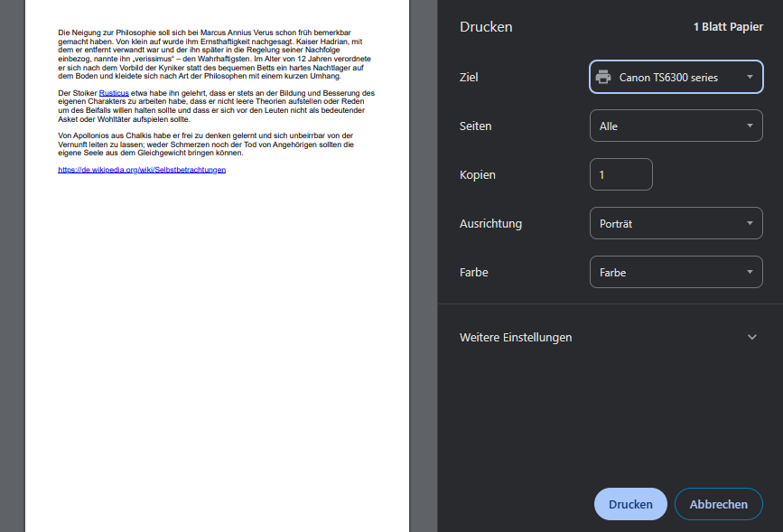

# Print Selection

Ein Obsidian-Plugin zum Exportieren markierter Texte als druckbare HTML-Datei. Die Auswahl lässt sich direkt über das Kontextmenü im Browser öffnen und von dort aus drucken. 

## Funktionen

- Markierten Text als HTML exportieren
- Direkt im Standardbrowser öffnen
- Druckansicht für schnellen Ausdruck oder PDF-Export
- Eintrag im Editor-Kontextmenü: **Auswahl drucken (im Browser)** 

## Verwendung

1. Text in Obsidian markieren.
2. Rechtsklick im Editor.
3. **Auswahl drucken (im Browser)** wählen.
4. Im Browser drucken oder als PDF speichern.

## Screenshots

## Installation

Plugin-Dateien in den Community-Plugin-Ordner kopieren und das Plugin in Obsidian aktivieren. Das Plugin ist nur für Desktop gedacht. fileciteturn0file0
